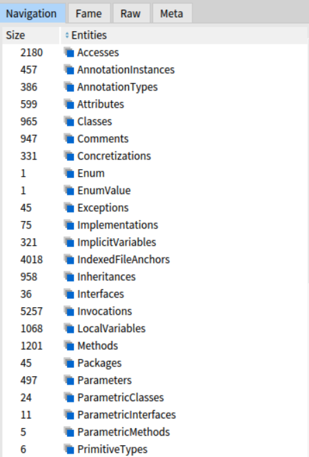
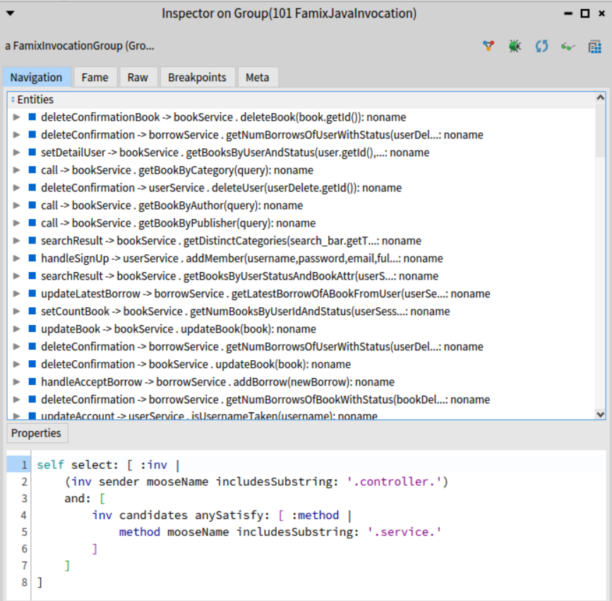
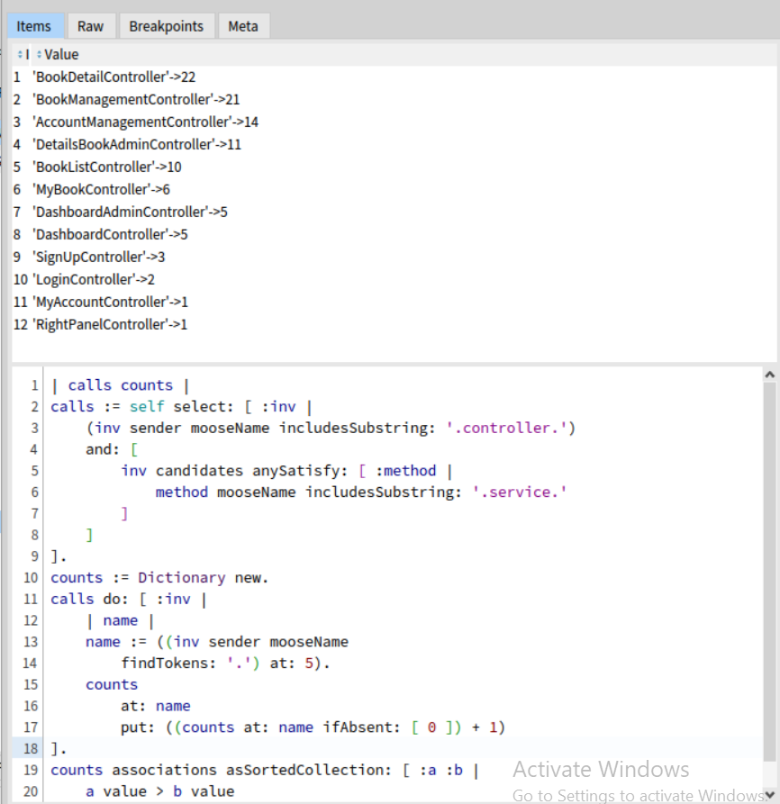
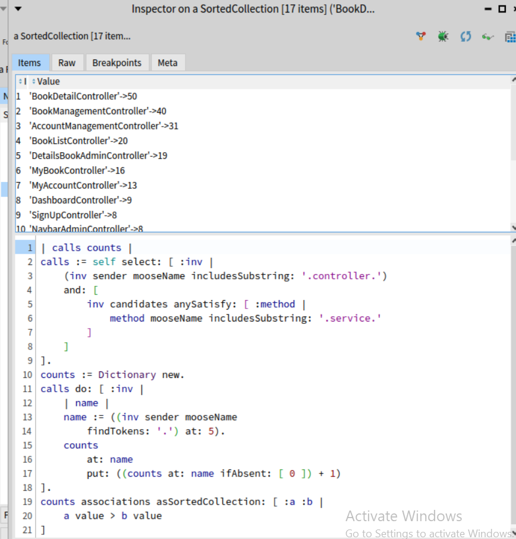

# Analiza softverskog sistema pomoću Moose platforme

Ovaj repozitorijum sadrži projekat analize softverskog sistema korišćenjem platforme Moose i FAMIX metamodela.

Kao studija slučaja odabran je open-source Java projekat za upravljanje bibliotekom (Library Management System).

Cilj je istraživanje strukture i zavisnosti softverskog sistema kroz različite nivoe apstrakcije i verzija projekta pomoću Moose platforme i FAMIX modela.

## Alati
- Moose Suite 12 osnova
- VerveineJ 4.2.6 za generisanje FAMIX modela iz izvornog koda
- Pharo/Smalltalk za izvršavanje upita nad FAMIX entitetima

## Učitavanje modela
Uz VerveineJ generisan je JSON model `models/bookverse-model.json`

Filtriranjem klasa prema svojstvu isStub izdvojeno je 67 "ne-stub" klasa uključujući unutrašnje i anonimne klase.

## Zavisnosti arhitekturnih slojeva
Prvi korak - ispitivanje poziva metoda paketa controller -> service -> dao

Primer upita za izdvajanje jednog poziva, izvršeno nad grupom Invocations.

U ovom momentu analize rezultat je u skladu sa očekivanom organizacijom aplikacije (controller->service->dao, bez uočenih direktnih poziva kontrolera ka metodama, kao ni povratnih poziva među slojevima)

## Analiza na nivou klasa i metoda
Ispitano je koje controller klase imaju najviše poziva ka service sloju.

`BookDetailController` ostvaruje 22 poziva ka 18 različitih servisnih metoda komunicirajući sa četiri servisne klase.

`BookManagementController` ostvaruje 21 poziv ka servisnim metodama raspoređenim u dve servisne klase.

Dakle, ova dva kontrolera imaju gotovo jednak broj poziva, ali različitu širinu zavisnosti. Broj poziva i broj različitih servisnih klasa predstavljaju različite aspekte povezanosti.

## Ispitivanje veličine kontrolera

U FAMIX modelu identifikovanao je 17 glavnih klasa čija imena sadrže Controller. Za njih je pronađeno ukupno 258 metoda.

Tri najveća kontrolera (BookDetailController, BookManagmentController i AccountManagementController) sadrže ukupno 121 od 258 metoda, odnosno približno 47% metoda svih posmatranih kontrolera. Naravno, još uvek nije dokaz preopterećenosti ili otežane održivosti.

### Beleške za dalje
- Da li u Bookverse aplikaciji postoje ciklične zavisnosti (klase/paketi) i kako su različite verzije projekta uticale na njih
- Grafovi zavisnosti i vizualizacija
- Identifikacija "preopterećenih" delova koda i promene kroz verzije (kako su nove funkcionalnosti uticale na povećanje složenosti ili zavisnosti)
- ..

### Izvori
- https://fuhrmanator.github.io/posts/typescript-in-moose/index.html
- https://github.com/SAP2Moose/SAP2Moose
- https://fuhrmanator.github.io/posts/analyzing-java-with-moose/index.html
- https://modularmoose.org/blog/2022-08-08-moosecritics/
- https://modularmoose.org/users/moose-ide/moose-critics/
- https://arxiv.org/pdf/2509.11748
- 
